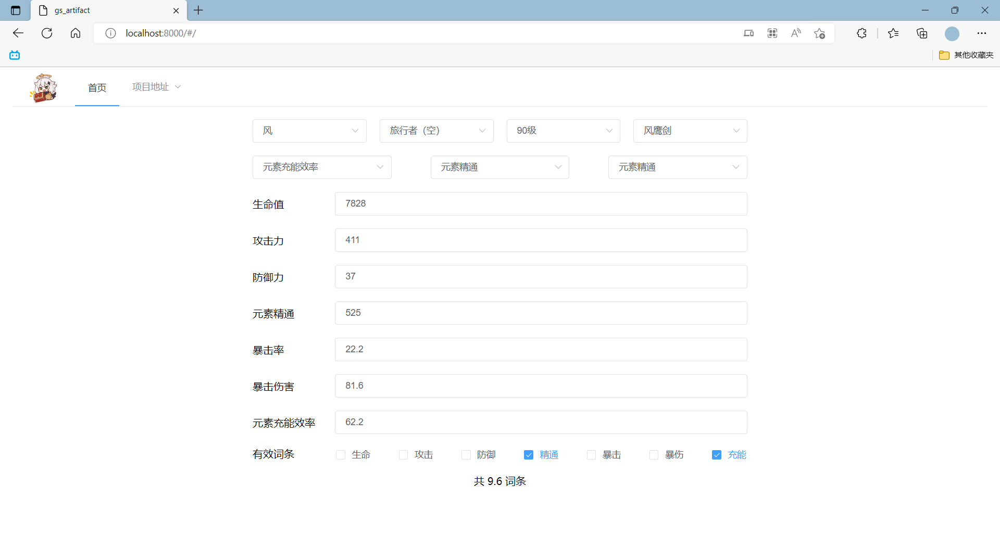

# gs_artifact

#### 介绍
基于Django+VUE搭建的原神圣遗物有效词条计算网页，用于计算的数据存储于MySQL，页面样式使用Element-UI完成。

#### 安装

安装Python依赖的库: Django、PyMySQL。

```
pip install -r requirements.txt
```
建议使用3.6+以上的Python版本。

#### 本地运行

1.  运行项目前，请确保已配置 gs_artifact\settings.py 的 MySQL 参数并连接数据库。
2.  移至项目的目录位置
```
cd gs_artifact
```
3.  使用以下命令运行
```
python manage.py runserver
```
4. 在浏览器中打开 http://localhost:8000/

#### 提示
项目所需的角色、武器数据可在 MySQL 手动增添，也可使用 [miyolab_crawl](https://github.com/haneball/miyolab_crawl) 爬虫快速填充数据库。

#### 示例
网页正常运行时，如图所示
